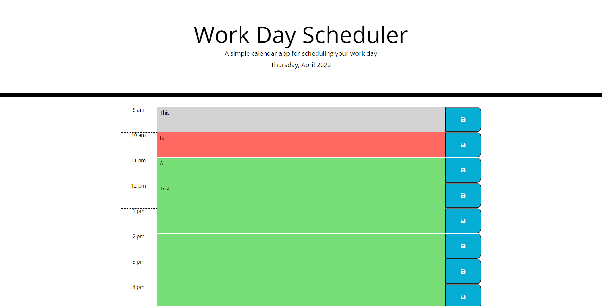

# Work Day Scheduler

## Description

The work day scheduler allows you to keep track of your daily work tasks. The scheduler will allow you to enter tasks and let you know if a time block is in the past, present or future.

## Table of Contents

* [Installation](#installation)
* [Usage](#usage)
* [Credits](#credits)
* [License](#license)

## Screenshots

## Installation
To install the app download the source code.

## Usage
You can either run a live server or you can run the HTML file in your default browser. Or you can visit this [link](https://chastainjon.github.io/work-day-scheduler/) to view the deployed page.

## Credits

* [Jonathan Chastain](https://github.com/ChastainJon)
* Moment.js
* JQuery

## License
### MIT License

## Questions

If you have any questions please feel free to reach out to me on [Github](ttps://github.com/ChastainJon)

